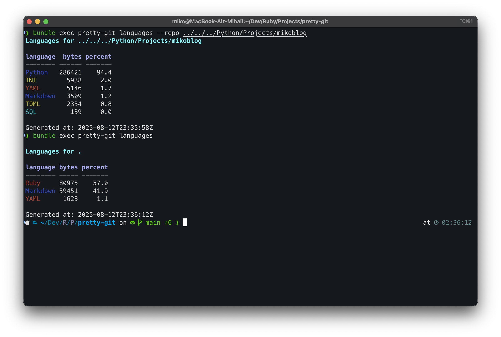
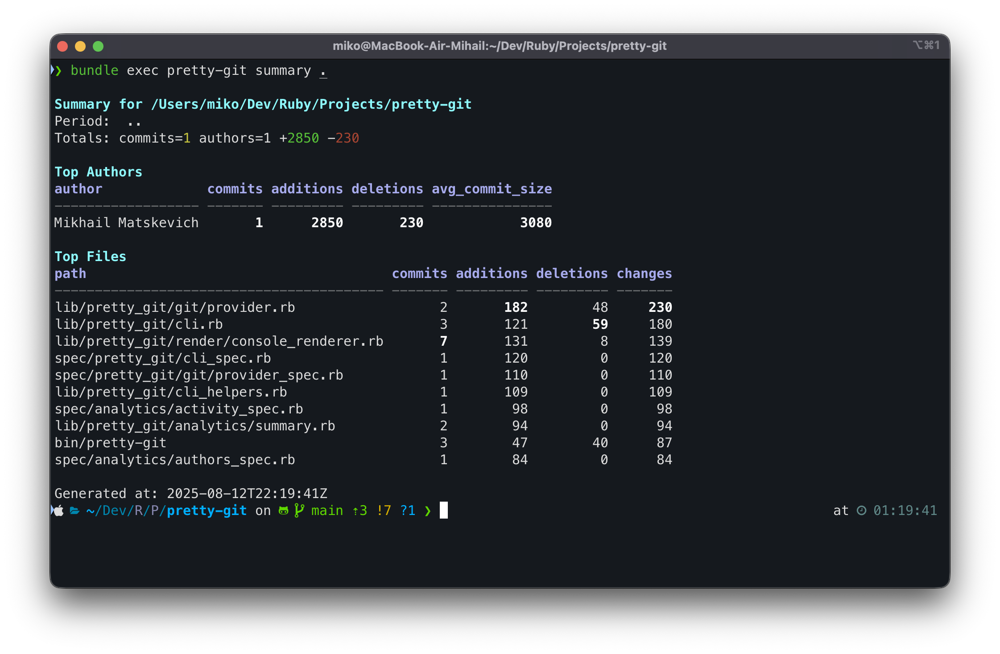

# Pretty Git

[](https://github.com/MikoMikocchi/pretty-git/actions/workflows/ci.yml)
[](https://rubygems.org/gems/pretty-git)
[](LICENSE)


<p align="right">
  <b>English</b> | <a href="./README.ru.md">Русский</a>
</p>

<p align="center">
  
  <br>
</p>

Generator of rich reports for a local Git repository: summary, activity, authors, files, heatmap, languages, hotspots, churn, ownership. Output to Console and formats: JSON, CSV, Markdown, YAML, XML.

— License: MIT.

## Table of Contents
- [Features](#features)
- [Requirements](#requirements)
- [Installation](#installation)
- [Quick Start](#quick-start)
- [CLI and Options](#cli-and-options)
  - [Filters](#filters)
  - [Output format](#output-format)
  - [Write to file](#write-to-file)
  - [Exit codes](#exit-codes)
- [Reports and Examples](#reports-and-examples)
  - [summary — repository summary](#summary--repository-summary)
  - [activity — activity (day/week/month)](#activity--activity-dayweekmonth)
  - [authors — by authors](#authors--by-authors)
  - [files — by files](#files--by-files)
  - [heatmap — commit heatmap](#heatmap--commit-heatmap)
  - [languages — languages](#languages--languages)
  - [hotspots — hotspots (risky files)](#hotspots--hotspots-risky-files)
  - [churn — code churn by file](#churn--code-churn-by-file)
  - [ownership — code ownership](#ownership--code-ownership)
- [Exports](#exports)
  - [Console](#console)
  - [JSON](#json)
  - [CSV](#csv)
  - [Markdown](#markdown)
  - [YAML](#yaml)
  - [XML](#xml)
- [Determinism and Sorting](#determinism-and-sorting)
- [Windows Notes](#windows-notes)
- [Diagnostics and Errors](#diagnostics-and-errors)
- [FAQ](#faq)
- [Development](#development)
- [License](#license)

## ✨ Features
* **Reports**: `summary`, `activity`, `authors`, `files`, `heatmap`, `languages`, `hotspots`, `churn`, `ownership`.
* **Filters**: branches, authors, paths, time period.
* **Exports**: `console`, `json`, `csv`, `md`, `yaml`, `xml`.
* **Output**: to stdout or file via `--out`.

## ❓ Why Pretty Git
* **One tool, many views**: activity, authorship, hotspots, languages, ownership — consistent UX and outputs.
* **Deterministic results**: stable sorting and formatting make it reliable for CI and diffs.
* **Format-first**: JSON/CSV/Markdown/YAML/XML out of the box with strict and documented rules.
* **Fast enough for daily use**: streams `git log` and aggregates in-memory; tips below for large repos.
* **Safe defaults**: sensible path and binary ignores for the `languages` report; colorized console output with themes.

## ⚙️ Requirements
* **Ruby**: >= 3.4 (recommended 3.4.x)
* **Git**: installed and available in `PATH`

## 📦 Installation

### 🍺 Homebrew (recommended)
```bash
brew tap MikoMikocchi/tap
brew install pretty-git
```

### ♦️ RubyGems
```bash
gem install pretty-git
```
Choose one:

1) 🛠️ From source (recommended for development)

```bash
git clone <repo_url>
cd pretty-git
bin/setup
# run:
bundle exec bin/pretty-git --help
```

2) ♦️ As a gem (after the first release)

```bash
gem install pretty-git
pretty-git --version
```

3) 📦 Via Bundler

```ruby
# Gemfile
gem 'pretty-git', '~> 0.1'
```
```bash
bundle install
bundle exec pretty-git --help
```

## 🚀 Quick Start
```bash
# Repository summary to console
bundle exec bin/pretty-git summary .

# Authors in JSON written to file
bundle exec bin/pretty-git authors . --format json --out authors.json

# Weekly activity for period only for selected paths
bundle exec bin/pretty-git activity . --time-bucket week --since 2025-01-01 \
  --paths app,lib --format csv --out activity.csv
```

## 🧰 CLI and Options
General form:

```bash
pretty-git <report> <repo_path> [options]
```

Notes:
* `<repo_path>` defaults to `.` if omitted.
* You can also pass the repository via `--repo PATH` as an alternative to the positional argument.

Available reports: `summary`, `activity`, `authors`, `files`, `heatmap`, `languages`, `hotspots`, `churn`, `ownership`.

Key options:
* **--format, -f** `console|json|csv|md|yaml|xml` (default `console`)
* **--out, -o** Path to write output file
* **--limit, -l** Number of items shown; `all` or `0` — no limit
* **--time-bucket** `day|week|month` (for `activity`)
* **--since/--until** Date/time in ISO8601 or `YYYY-MM-DD`
* **--branch** Multi-option, can be specified multiple times
* **--author/--exclude-author** Filter by authors
* **--path/--exclude-path** Filter by paths (comma-separated or repeated option)
* **--no-color** Disable colors in console
* **--theme** `basic|bright|mono` — console theme (default `basic`; `mono` forces monochrome)
* **--metric** `bytes|files|loc` — metric for `languages` report (default `bytes`)
* **--verbose** Print debug information (effective git command, filters)

Examples with multiple values:

```bash
# Multiple branches (treated as explicit revisions)
pretty-git summary . --branch main --branch develop
## This is equivalent to:
## git log main develop -- ...

# Filter authors (include/exclude)
pretty-git authors . --author alice@example.com --exclude-author bot@company

# Filter paths
pretty-git files . --path app,lib --exclude-path vendor,node_modules
```

### Filters
Filters apply at commit fetch and later aggregation. Below — exact semantics and tips.

#### Branches / revisions
* `--branch BRANCH` may be provided multiple times.
* Multiple branches are treated as explicit revisions to `git log` (no implicit merge-base range). Example: `--branch main --branch develop` → `git log main develop -- ...`.
* If no branches are specified, the repository’s current `HEAD` is used.

#### Authors
* `--author` and `--exclude-author` accept name or email substrings (case-insensitive match by `git log`).
* Multiple values may be provided by repeating the option.

#### Paths
* `--path` and `--exclude-path` accept comma-separated values or repeated options.
* Globs are supported by git pathspec. Excludes are translated to `:(exclude)pattern` and applied consistently.
* When only excludes are present, `.` is included to ensure the pathspec is valid (mirrors tests in `spec/pretty_git/git/provider_spec.rb`).

#### Time period
* `--since` / `--until`: ISO8601 (e.g. `2025-01-31T12:00:00Z`) or `YYYY-MM-DD`.
* Date-only values are interpreted as UTC midnight to avoid timezone drift in different environments.
* Time values are normalized to UTC in outputs.

#### Verbose diagnostics
* `--verbose` prints the effective `git log` command and active filters to stderr.
* Useful for debugging filters, CI logs, or when reproducing results locally.

### Output format
Set via `--format`. For file formats it’s recommended to use `--out`.

### Write to file
```bash
pretty-git authors . --format csv --out authors.csv
```

### Exit codes
* `0` — success
* `1` — user error (unknown report/format, bad arguments)
* `2` — system error (git error etc.)

## 📊 Reports and Examples

### 🧭 summary — repository summary
```bash
pretty-git summary . --format json
```
Contains totals (commits, authors, additions, deletions) and top authors/files.

### 📆 activity — activity (day/week/month)
```bash
pretty-git activity . --time-bucket week --format csv
```
CSV columns: `bucket,timestamp,commits,additions,deletions`.
JSON example:
```json
[
  {"bucket":"week","timestamp":"2025-06-02T00:00:00Z","commits":120,"additions":3456,"deletions":2100},
  {"bucket":"week","timestamp":"2025-06-09T00:00:00Z","commits":98,"additions":2890,"deletions":1760}
]
```

### 👤 authors — by authors
```bash
pretty-git authors . --format md --limit 10
```
CSV columns: `author,author_email,commits,additions,deletions,avg_commit_size`.
Markdown example:
```markdown
| author | author_email | commits | additions | deletions | avg_commit_size |
|---|---|---:|---:|---:|---:|
| Alice | a@example.com | 2 | 5 | 1 | 3.0 |
| Bob   | b@example.com | 1 | 2 | 0 | 2.0 |
```

### 📁 files — by files
```bash
pretty-git files . --paths app,lib --format csv
```
CSV columns: `path,commits,additions,deletions,changes`.

XML example:
```xml
<?xml version="1.0" encoding="UTF-8"?>
<report>
  <report>files</report>
  <generated_at>2025-01-31T00:00:00Z</generated_at>
  <repo_path>/abs/path/to/repo</repo_path>
  <items>
    <item>
      <path>app/models/user.rb</path>
      <commits>42</commits>
      <additions>2100</additions>
      <deletions>1400</deletions>
      <changes>3500</changes>
    </item>
    <item>
      <path>app/services/auth.rb</path>
      <commits>35</commits>
      <additions>1500</additions>
      <deletions>900</deletions>
      <changes>2400</changes>
    </item>
  </items>
</report>
```

### 🔥 heatmap — commit heatmap
```bash
pretty-git heatmap . --format json
```
JSON: an array of buckets for (day-of-week × hour) with commit counts.
CSV example:
```csv
dow,hour,commits
1,10,5
1,11,7
```

### 🈺 languages — languages
```bash
pretty-git languages . --format md --limit 10
```
Determines language distribution in a repository. Supports multiple metrics: `bytes`, `files`, `loc` (default: `bytes`). Output includes language, selected metric column, and percent share; console shows language colors.

Console example:
```text
Languages for .

language     bytes percent
-------- ---------- -------
Ruby        123456    60.0
JavaScript   78901    38.3
Markdown      1200     1.7
```



Notes:
- **Detection**: by file extensions and certain filenames (`Makefile`, `Dockerfile`).
- **Exclusions**: binary files and "vendor"-like directories are ignored. By default `vendor/`, `node_modules/`, `.git/`, build artifacts and caches are skipped. For Python projects additional directories are skipped: `.venv/`, `venv/`, `env/`, `__pycache__/`, `.mypy_cache/`, `.pytest_cache/`, `.tox/`, `.eggs/`, `.ruff_cache/`, `.ipynb_checkpoints/`.
- **JSON**: JSON is included as a language. If large data files skew results, consider narrowing with `--path/--exclude-path`.
- **Path filters**: use `--path/--exclude-path` (glob patterns supported) to focus on relevant areas.
- **Limit**: `--limit N` restricts number of rows; `0`/`all` — no limit.
- **Console colors**: language names use approximate GitHub colors; `--no-color` disables, `--theme mono` makes output monochrome.

See also: [Ignored directories and files](#ignored-directories-and-files).

Export:
- CSV/MD: columns are dynamic — `language,<metric>,percent`. Markdown also includes a `color` column.
- JSON/YAML/XML: full report structure including per-language `color` and metadata (`report`, `generated_at`, `repo_path`).

### ⚠️ hotspots — hotspots (risky files)
```bash
pretty-git hotspots . --format csv --limit 20
```
Highlights riskier files combining change frequency and magnitude.

CSV columns: `path,score,commits,additions,deletions,changes`.

Example:
```csv
path,score,commits,additions,deletions,changes
lib/a.rb,9.5,12,300,220,520
app/b.rb,7.1,8,140,60,200
```

JSON example:
```json
{
  "report": "hotspots",
  "generated_at": "2025-01-31T00:00:00Z",
  "repo_path": ".",
  "items": [
    {"path": "lib/a.rb", "score": 9.5, "commits": 12, "additions": 300, "deletions": 220, "changes": 520}
  ]
}
```

### 🔄 churn — code churn by file
```bash
pretty-git churn . --format md --limit 20
```
Measures code churn (amount of code changing frequently).

CSV columns: `path,churn,commits,additions,deletions`.

Markdown example:
```markdown
| path | churn | commits | additions | deletions |
|---|---:|---:|---:|---:|
| lib/a.rb | 520 | 12 | 300 | 220 |
```

YAML example:
```yaml
report: churn
generated_at: '2025-01-31T00:00:00Z'
repo_path: .
items:
  - path: lib/a.rb
    churn: 520
    commits: 12
    additions: 300
    deletions: 220
```

### 🏷️ ownership — code ownership
```bash
pretty-git ownership . --format csv --limit 50
```
Shows file ownership concentration per primary owner.

CSV columns: `path,owner,owner_share,authors`.

Notes:
- `owner`: author identifier (name/email) with the largest share of edits.
- `owner_share`: percent of edits by the owner (0..100).
- `authors`: total unique authors who edited the file.

XML example:
```xml
<?xml version="1.0" encoding="UTF-8"?>
<report>
  <report>ownership</report>
  <generated_at>2025-01-31T00:00:00Z</generated_at>
  <repo_path>.</repo_path>
  <items>
    <item>
      <path>lib/a.rb</path>
      <owner>Alice &lt;a@example.com&gt;</owner>
      <owner_share>82.5</owner_share>
      <authors>2</authors>
    </item>
  </items>
</report>
```

## 📤 Exports

Below are exact serialization rules for each format to ensure compatibility with common tools (Excel, BI, CI, etc.).

### 🖥️ Console

_Example terminal output (theme: basic)._ 
* **Colors**: headers and table heads highlighted; totals: `commits` — yellow, `+additions` — green, `-deletions` — red. `--no-color` fully disables coloring.
* **Themes**: `--theme basic|bright|mono`. `bright` — more saturated headers, `mono` — monochrome (same as `--no-color`).
* **Highlight max**: numeric columns underline max values in bold for quick scanning.
* **Terminal width**: table output respects terminal width; first column is gracefully truncated with ellipsis `…` if needed.
* **Encoding**: UTF‑8, LF line endings.
* **Purpose**: human-readable terminal output.
* **Layout**: boxed tables, auto-truncation of long values.

### 🧾 JSON
* **Keys**: `snake_case`.
* **Numbers**: integers/floats without localization (dot decimal separator).
* **Boolean**: `true/false`; **null**: `null`.
* **Date/time**: ISO8601 in UTC, e.g. `2025-01-31T00:00:00Z`.
* **Order**: fields arranged logically and consistently (e.g., `report`, `generated_at`, `repo_path`, then data).
* **Encoding/line endings**: UTF‑8, LF.
* **Suggested extension**: `.json`.
* **Example**:
  ```json
  {"report":"summary","generated_at":"2025-01-31T00:00:00Z","totals":{"commits":123}}
  ```

## 🧾 Schemas and Examples
Machine-readable examples and schemas live under `docs/export_schemas/` and `docs/examples/`.

* **Schemas**: see `docs/export_schemas/README.md` for JSON and XML schema notes.
* **Examples**: example payloads for JSON/XML for each report under `docs/examples/`.
* Intended use: validation in CI, contract documentation, and integration tests.

### CSV
* **Structure**: flat table, first line is header.
* **Encoding**: UTF‑8 without BOM.
* **Delimiter**: comma `,`.
* **Escaping**: RFC 4180 — fields with commas/quotes/newlines are enclosed in double quotes, double quotes inside are doubled.
* **Empty values**: empty cell (not `null`).
* **Numbers**: no thousand separators, dot as decimal.
* **Date/time**: ISO8601 UTC.
* **Column order**: fixed per report and stable.
* **Line endings**: LF.
* **Suggested extension**: `.csv`.
* **Excel**: specify UTF‑8 on import.
* **Example**:
  ```csv
  author,author_email,commits,additions,deletions,avg_commit_size
  Alice,a@example.com,2,5,1,3.0
  Bob,b@example.com,1,2,0,2.0
  ```

### 📝 Markdown
* **Tables**: GitHub Flavored Markdown.
* **Alignment**: numeric columns are right-aligned (`---:`).
* **Encoding/line endings**: UTF‑8, LF.
* **Suggested extension**: `.md`.
* **Empty datasets**: header-only table or a short `No data` message (depends on report).
* **Example**:
  ```markdown
  | path | commits | additions | deletions |
  |---|---:|---:|---:|
  | app/models/user.rb | 42 | 2100 | 1400 |
  ```

### 📄 YAML
* **Structure**: full result hierarchy.
* **Keys**: serialized as strings.
* **Numbers/boolean/null**: standard YAML (`123`, `true/false`, `null`).
* **Date/time**: ISO8601 UTC as strings.
* **Encoding/line endings**: UTF‑8, LF.
* **Suggested extension**: `.yml` or `.yaml`.
* **Example**:
  ```yaml
  report: authors
  generated_at: "2025-01-31T00:00:00Z"
  items:
    - author: Alice
      author_email: a@example.com
      commits: 2
    - author: Bob
      author_email: b@example.com
      commits: 1
  ```

### 🗂️ XML
* **Structure**: elements correspond to keys; arrays — repeated `<item>` or specialized tags.
* **Attributes**: for compact rows (e.g., files report) main fields may be attributes.
* **Text nodes**: used for scalar values when needed.
* **Escaping**: `& < > " ' ` per XML rules; CDATA may be used for arbitrary text.
* **Date/time**: ISO8601 UTC.
* **Encoding/line endings**: UTF‑8, LF; declaration `<?xml version="1.0" encoding="UTF-8"?>` may be added by the generator.
* **Suggested extension**: `.xml`.
* **Example**:
  ```xml
  <authors>
    <item author="Alice" author_email="a@example.com" commits="2" />
    <item author="Bob" author_email="b@example.com" commits="1" />
    <generated_at>2025-01-31T00:00:00Z</generated_at>
    <repo_path>/abs/path</repo_path>
  </authors>
  ```

## 🚫 Ignored directories and files

To keep language statistics meaningful, certain directories and file types are skipped by default.

**Directories ignored** (any path segment matching one of these):

```
vendor, node_modules, .git, .bundle, dist, build, out, target, coverage,
.venv, venv, env, __pycache__, .mypy_cache, .pytest_cache, .tox, .eggs, .ruff_cache,
.ipynb_checkpoints
```

**Binary/data extensions ignored**:

```
.png, .jpg, .jpeg, .gif, .svg, .webp, .ico, .bmp,
.pdf, .zip, .tar, .gz, .tgz, .bz2, .7z, .rar,
.mp3, .ogg, .wav, .mp4, .mov, .avi, .mkv,
.woff, .woff2, .ttf, .otf, .eot,
.jar, .class, .dll, .so, .dylib,
.exe, .bin, .dat
```

These lists mirror the implementation in `lib/pretty_git/analytics/languages.rb` and may evolve.

## 🔁 Determinism and Sorting
Output is deterministic given the same input. Sorting for files/authors: by changes (desc), then by commits (desc), then by path/name (asc). Limits are applied after sorting; `all` or `0` means no limit.

## ⚡ Performance Tips
* Prefer narrowing by `--path`/`--exclude-path` and `--since/--until` on large repositories.
* Use multiple `--branch` only when you explicitly want to include several heads; otherwise rely on current `HEAD`.
* For CI, cache the repository and fetch shallow history if full history is unnecessary for your report.

## 🤖 CI Usage
Examples for common pipelines:

```yaml
# GitHub Actions (excerpt)
jobs:
  reports:
    runs-on: ubuntu-latest
    steps:
      - uses: actions/checkout@v4
      - uses: ruby/setup-ruby@v1
        with:
          ruby-version: '3.4'
      - run: gem install pretty-git
      - run: pretty-git authors . --format json --out authors.json
      - uses: actions/upload-artifact@v4
        with:
          name: authors-report
          path: authors.json
```

## 🪟 Windows Notes
Primary targets — macOS/Linux. Windows is supported best‑effort. See detailed notes in [docs/windows.md](docs/windows.md).

Highlights:
* Running via Git Bash/WSL is recommended.
* CRLF output from git is handled by the parser; exports use UTF‑8 with LF.
* Path filters are normalized to Unicode NFC when available; otherwise pass‑through.
* Colors can be disabled by `--no-color` or `--theme mono`.

## 🩺 Diagnostics and Errors
Typical issues and solutions:

* **Unknown report/format** — check the first argument and `--format`.
* **Debugging** — add `--verbose` to see the effective `git log` command and applied filters.
* **Invalid date format** — use ISO8601 or `YYYY-MM-DD` (e.g., `2025-01-31` or `2025-01-31T12:00:00Z`).
* **Git not available** — ensure `git` is installed and in the `PATH`.
* **Empty result** — check your filters (`--since/--until`, `--branch`, `--path`); your selection might be too narrow.
* **CSV encoding issues** — files are saved as UTF‑8; when opening in Excel, pick UTF‑8.

## ❓ FAQ
* **Why Ruby 3.4+?** The project uses dependencies aligned with Ruby 3.4+ and targets the current ecosystem.
* **New formats?** Yes, add a renderer under `lib/pretty_git/render/` and wire it in the app.
* **Where does data come from?** From system `git` via CLI calls.

## 🛠️ Development
```bash
# Install deps
bin/setup

# Run tests and linter
bundle exec rspec
bundle exec rubocop
```

Style — RuboCop clean. Tests cover aggregators, renderers, CLI, and integration scenarios (determinism, format correctness).

For detailed testing strategy, determinism rules, and golden tests workflow (how to run/update snapshots), see `docs/testing.md`.

## 📄 License
MIT © Contributors
