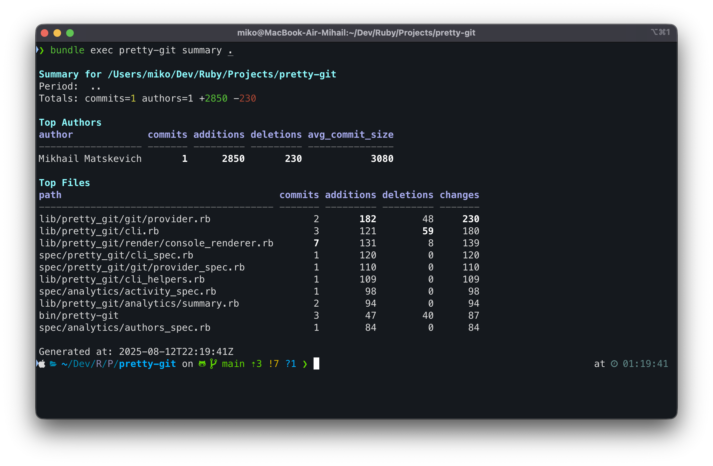

# Pretty Git

[](https://github.com/MikoMikocchi/pretty-git/actions/workflows/ci.yml)
[](LICENSE)


<p align="right">
  <a href="./README.md">English</a> | <b>Русский</b>
</p>

<p align="center">
  
  <br>
</p>

Генератор отчётов по локальному Git-репозиторию: сводка, активность, авторы, файлы, тепловая карта. Вывод в консоль и форматы: JSON, CSV, Markdown, YAML, XML.

— Лицензия: MIT.

## Содержание
- [Возможности](#возможности)
- [Требования](#требования)
- [Установка](#установка)
- [Быстрый старт](#быстрый-старт)
- [CLI и параметры](#cli-и-параметры)
  - [Фильтры](#фильтры)
  - [Формат вывода](#формат-вывода)
  - [Вывод в файл](#вывод-в-файл)
  - [Коды возврата](#коды-возврата)
- [Отчёты и примеры](#отчёты-и-примеры)
  - [summary — сводка](#summary--сводка)
  - [activity — активность (day/week/month)](#activity--активность-dayweekmonth)
  - [authors — по авторам](#authors--по-авторам)
  - [files — по файлам](#files--по-файлам)
  - [heatmap — тепловая карта](#heatmap--тепловая-карта)
  - [languages — языки](#languages--языки)
- [Экспорт в форматы](#экспорт-в-форматы)
  - [Console](#console)
  - [JSON](#json)
  - [CSV (DR-001)](#csv-dr-001)
  - [Markdown](#markdown)
  - [YAML](#yaml)
  - [XML](#xml)
- [Детерминизм и сортировка](#детерминизм-и-сортировка)
- [Советы по Windows](#советы-по-windows)
- [Диагностика и ошибки](#диагностика-и-ошибки)
- [FAQ](#faq)
- [Разработка](#разработка)
- [Лицензия](#лицензия)

## Возможности
* __Отчёты__: `summary`, `activity`, `authors`, `files`, `heatmap`, `languages`.
* __Фильтры__: ветки, авторы, пути, период времени.
* __Экспорт__: `console`, `json`, `csv`, `md`, `yaml`, `xml`.
* __Вывод__: в stdout или файл через `--out`.

## Требования
* __Ruby__: >= 3.4 (рекомендуется 3.4.x)
* __Git__: установлен и доступен в `PATH`

## Установка
Выберите один из вариантов:

1) Локально из исходников (рекомендуется для разработки)

```bash
git clone <repo_url>
cd pretty-git
bin/setup
# запуск:
bundle exec bin/pretty-git --help
```

2) Как gem (после первого релиза)

```bash
gem install pretty-git
pretty-git --version
```

3) Использование через Bundler

```ruby
# Gemfile
gem 'pretty-git', '~> 0.1'
```
```bash
bundle install
bundle exec pretty-git --help
```

## Быстрый старт
```bash
# Сводка репозитория в консоль
bundle exec bin/pretty-git summary .

# Авторы в JSON и запись в файл
bundle exec bin/pretty-git authors . --format json --out authors.json

# Активность по неделям за период и только по указанным путям
bundle exec bin/pretty-git activity . --time-bucket week --since 2025-01-01 \
  --paths app,lib --format csv --out activity.csv
```

## CLI и параметры
Общий вид:

```bash
pretty-git <report> <repo_path> [options]
```

Доступные отчёты: `summary`, `activity`, `authors`, `files`, `heatmap`.

Ключевые опции:
* __--format, -f__ `console|json|csv|md|yaml|xml` (по умолчанию `console`)
* __--out, -o__ Путь для записи в файл
* __--limit, -l__ Число элементов в топах/выводе; `all` или `0` — без ограничения
* __--time-bucket__ `day|week|month` (для `activity`)
* __--since/--until__ Дата/время в ISO8601 или `YYYY-MM-DD` (DR-005)
* __--branch__ Мульти-опция, можно указывать несколько веток
* __--author/--exclude-author__ Фильтрация по авторам
* __--path/--exclude-path__ Фильтрация по путям (через запятую или повтор опции)
* __--no-color__ Отключить цвета в консоли
* __--theme__ `basic|bright|mono` — тема оформления консольного вывода (по умолчанию `basic`; `mono` принудительно отключает цвета)

Примеры значений с несколькими параметрами:

```bash
# Несколько веток
pretty-git summary . --branch main --branch develop

# Фильтрация по авторам (включая/исключая)
pretty-git authors . --author alice@example.com --exclude-author bot@company

# Фильтрация по путям
pretty-git files . --path app,lib --exclude-path vendor,node_modules
```

### Фильтры
Фильтры применяются на этапе выборки коммитов и последующей агрегации. Формат дат: ISO8601 или `YYYY-MM-DD`. Если часовой пояс не указан — используется локальная зона пользователя; на выводе время нормализуется к UTC.

### Формат вывода
Задаётся через `--format`. Для файловых форматов рекомендуется использовать `--out`.

### Вывод в файл
```bash
pretty-git authors . --format csv --out authors.csv
```

### Коды возврата
* `0` — успех
* `1` — ошибка пользователя (неизвестный отчёт/формат, неверные аргументы)
* `2` — системная ошибка (ошибка Git и пр.)

## Отчёты и примеры

### summary — сводка
```bash
pretty-git summary . --format json
```
Содержит totals (commits, authors, additions, deletions) и топы по авторам/файлам.

### activity — активность (day/week/month)
```bash
pretty-git activity . --time-bucket week --format csv
```
CSV-колонки: `bucket,timestamp,commits,additions,deletions`.
Пример JSON:
```json
[
  {"bucket":"week","timestamp":"2025-06-02T00:00:00Z","commits":120,"additions":3456,"deletions":2100},
  {"bucket":"week","timestamp":"2025-06-09T00:00:00Z","commits":98,"additions":2890,"deletions":1760}
]
```

### authors — по авторам
```bash
pretty-git authors . --format md --limit 10
```
CSV-колонки: `author,author_email,commits,additions,deletions,avg_commit_size`.
Пример Markdown:
```markdown
| author | author_email | commits | additions | deletions | avg_commit_size |
|---|---|---:|---:|---:|---:|
| Alice | a@example.com | 2 | 5 | 1 | 3.0 |
| Bob   | b@example.com | 1 | 2 | 0 | 2.0 |
```

### files — по файлам
```bash
pretty-git files . --paths app,lib --format csv
```
CSV-колонки: `path,commits,additions,deletions,changes`.
Пример XML:
```xml
<files>
  <item path="app/models/user.rb" commits="42" additions="2100" deletions="1400" changes="3500" />
  <item path="app/services/auth.rb" commits="35" additions="1500" deletions="900" changes="2400" />
  <generated_at>2025-01-31T00:00:00Z</generated_at>
  <repo_path>/abs/path/to/repo</repo_path>
  <report>files</report>
  <period>
    <since/>
    <until/>
  </period>
  </files>
```

### heatmap — тепловая карта
```bash
pretty-git heatmap . --format json
```
JSON: массив бакетов по (день недели × час) с числом коммитов.
Пример CSV:
```csv
dow,hour,commits
1,10,5
1,11,7
```

### languages — языки
```bash
pretty-git languages . --format md --limit 10
```
Определяет распределение языков в репозитории по сумме байт файлов каждого языка (аналогично подходу GitHub Linguist). Вывод включает язык, суммарный размер (bytes) и долю в процентах.

Пример консольного вывода:
```text
Languages for .

language     bytes percent
-------- ---------- -------
Ruby        123456    60.0
JavaScript   78901    38.3
Markdown      1200     1.7
```


Замечания:
- __Определение языка__: по расширениям файлов и некоторым именам файлов (`Makefile`, `Dockerfile`).
- __Исключения__: бинарные файлы и "vendor"‑директории игнорируются. По умолчанию пропускаются `vendor/`, `node_modules/`, `.git/`, артефакты сборки и кэши. Для Python дополнительно исключаются `.venv/`, `venv/`, `env/`, `__pycache__/`, `.mypy_cache/`, `.pytest_cache/`, `.tox/`, `.eggs/`, `.ruff_cache/`, `.ipynb_checkpoints/`.
- __JSON__: по умолчанию JSON не учитывается как язык, чтобы крупные данные не искажали статистику.
- __Фильтры путей__: используйте `--path/--exclude-path` (поддерживаются glob‑маски), чтобы сосредоточиться на соответствующих директориях.
- __Лимит__: `--limit N` ограничивает число строк в итоговой таблице; `0`/`all` — без ограничения.
- __Цвета в консоли__: имена языков подсвечиваются приблизительными цветами GitHub; `--no-color` отключает, `--theme mono` делает монохром.

Экспорт:
- CSV/MD: колонки — `language,bytes,percent`.
- JSON/YAML/XML: полная структура отчёта, включая метаданные (`report`, `generated_at`, `repo_path`).

## Игнорируемые директории и файлы

Чтобы статистика по языкам оставалась релевантной, некоторые директории и типы файлов пропускаются по умолчанию.

**Игнорируемые директории** (если сегмент пути совпадает):

```
vendor, node_modules, .git, .bundle, dist, build, out, target, coverage,
.venv, venv, env, __pycache__, .mypy_cache, .pytest_cache, .tox, .eggs, .ruff_cache,
.ipynb_checkpoints
```

**Игнорируемые бинарные/данные расширения**:

```
.png, .jpg, .jpeg, .gif, .svg, .webp, .ico, .bmp,
.pdf, .zip, .tar, .gz, .tgz, .bz2, .7z, .rar,
.mp3, .ogg, .wav, .mp4, .mov, .avi, .mkv,
.woff, .woff2, .ttf, .otf, .eot,
.jar, .class, .dll, .so, .dylib,
.exe, .bin, .dat
```

Списки соответствуют реализации в `lib/pretty_git/analytics/languages.rb` и могут изменяться.

## Экспорт в форматы

Ниже — точные правила сериализации для каждого формата, чтобы обеспечивалась совместимость с популярными инструментами (Excel, BI, CI и т.п.).

### Console

_Пример вывода в терминале (тема: basic)._ 
* __Цвета__: заголовки и шапки таблиц подсвечены; суммы: `commits` — жёлтым, `+additions` — зелёным, `-deletions` — красным. `--no-color` полностью отключает раскраску.
* __Темы__: `--theme basic|bright|mono`. `bright` — более насыщенные заголовки, `mono` — монохром (аналогично `--no-color`).
* __Выделение максимума__: на числовых колонках максимальные значения подчёркиваются жирным для быстрого сканирования.
* __Ширина терминала__: при выводе таблиц автоматически учитывается ширина терминала. Если ширины не хватает, первый столбец аккуратно обрезается с многоточием `…`.
* __Кодировка__: UTF‑8, переводы строк LF.
* __Назначение__: человекочитаемый вывод в терминал.
* __Оформление__: таблицы с границами, авто-обрезка длинных значений.
* __Цвета__: включены, если есть TTY; отключаются `--no-color`.
* __Пустые наборы__: печатается `No data`.
* __Кодировка/переводы строк__: UTF‑8, LF (`\n`).

### JSON
* __Ключи__: `snake_case`.
* __Числа__: целые/вещественные без локализации (точка как разделитель).
* __Булевы__: `true/false`; __null__: `null`.
* __Даты/время__: ISO8601 в UTC, например `2025-01-31T00:00:00Z`.
* __Порядок__: поля в объектах стабильно упорядочены логически (например, `report`, `generated_at`, `repo_path`, затем данные).
* __Кодировка/переводы строк__: UTF‑8, LF.
* __Рекомендуемое расширение__: `.json`.
* __Пример__:
  ```json
  {"report":"summary","generated_at":"2025-01-31T00:00:00Z","totals":{"commits":123}}
  ```

### CSV
* __Структура__: плоская таблица, первая строка — заголовок.
* __Кодировка__: UTF‑8, без BOM.
* __Разделитель__: запятая `,`.
* __Экранирование__: по RFC 4180 — поля с запятыми/кавычками/переводами строк заключаются в двойные кавычки, двойные кавычки внутри поля удваиваются.
* __Пустые значения__: пустая ячейка (не `null`).
* __Числа__: без тысячных разделителей, десятичная точка.
* __Даты/время__: ISO8601 UTC.
* __Порядок колонок__: фиксирован на отчёт и стабилен.
* __Переводы строк__: LF.
* __Рекомендуемое расширение__: `.csv`.
* __Открытие в Excel__: указывайте кодировку UTF‑8 при импорте.
* __Пример__:
  ```csv
  author,author_email,commits,additions,deletions,avg_commit_size
  Alice,a@example.com,2,5,1,3.0
  Bob,b@example.com,1,2,0,2.0
  ```

### Markdown
* __Таблицы__: стандартный синтаксис GitHub Flavored Markdown.
* __Выравнивание__: числовые колонки выравниваются по правому краю (`---:`).
* __Кодировка/переводы строк__: UTF‑8, LF.
* __Рекомендуемое расширение__: `.md`.
* __Пустые наборы__: таблица с заголовком и без строк либо краткое сообщение `No data` (в зависимости от отчёта).
* __Пример__:
  ```markdown
  | path | commits | additions | deletions |
  |---|---:|---:|---:|
  | app/models/user.rb | 42 | 2100 | 1400 |
  ```

### YAML
* __Структура__: полная иерархия результата.
* __Ключи__: сериализуются строками.
* __Числа/булевы/null__: стандарт YAML (`123`, `true/false`, `null`).
* __Даты/время__: ISO8601 UTC как строки.
* __Кодировка/переводы строк__: UTF‑8, LF.
* __Рекомендуемое расширение__: `.yml` или `.yaml`.
* __Пример__:
  ```yaml
  report: authors
  generated_at: "2025-01-31T00:00:00Z"
  items:
    - author: Alice
      author_email: a@example.com
      commits: 2
    - author: Bob
      author_email: b@example.com
      commits: 1
  ```

### XML
* __Структура__: элементы соответствуют ключам; массивы — повторяющиеся `<item>` или специализированные теги.
* __Атрибуты__: для компактных записей (например, строк файлового отчёта) основные поля могут быть атрибутами элемента.
* __Текстовые узлы__: применяются для скалярных значений при необходимости.
* __Экранирование__: `& < > " ' ` по правилам XML, при необходимости CDATA для произвольного текста.
* __Даты/время__: ISO8601 UTC.
* __Кодировка/переводы строк__: UTF‑8, LF; декларация `<?xml version="1.0" encoding="UTF-8"?>` может добавляться генератором.
* __Рекомендуемое расширение__: `.xml`.
* __Пример__:
  ```xml
  <authors>
    <item author="Alice" author_email="a@example.com" commits="2" />
    <item author="Bob" author_email="b@example.com" commits="1" />
    <generated_at>2025-01-31T00:00:00Z</generated_at>
    <repo_path>/abs/path</repo_path>
  </authors>
  ```

## Детерминизм и сортировка
Вывод детерминирован при одинаковых входных данных. Сортировка для файлов/авторов: по количеству изменений (desc), затем по числу коммитов (desc), затем по пути/имени (asc). Лимиты применяются поверх отсортированного списка; значение `all` или `0` означает отсутствие ограничения.

## Советы по Windows
Целевая платформа — macOS/Linux. Windows поддерживается в режиме best‑effort:
* Запуск через Git Bash/WSL допустим
* Цвета можно отключить `--no-color`
* Аккуратное квотирование аргументов при работе с путями

## Диагностика и ошибки
Типичные ошибки и решения:

* __Неизвестный отчёт/формат__ — проверьте значение первого аргумента и `--format`.
* __Неверный формат даты__ — используйте ISO8601 или `YYYY-MM-DD` (например, `2025-01-31` или `2025-01-31T12:00:00Z`).
* __Git недоступен__ — убедитесь, что `git` установлен и доступен в `PATH`.
* __Пустой результат__ — проверьте фильтры (`--since/--until`, `--branch`, `--path`), возможно, выборка слишком узкая.
* __Проблемы с кодировкой CSV__ — файлы сохраняются в UTF‑8, при открытии в Excel выбирайте UTF‑8.

## FAQ
* __Почему Ruby 3.4+?__ Проект использует зависимости, согласованные с версией 3.4+, и ориентируется на актуальную экосистему.
* __Можно ли добавить новые форматы?__ Да, добавьте рендерер в `lib/pretty_git/render/` и зарегистрируйте его в приложении.
* __Откуда берутся данные?__ Из системного `git` через вызовы CLI.

## Разработка
```bash
# Установка зависимостей
bin/setup

# Запуск тестов и линтера
bundle exec rspec
bundle exec rubocop
```

Стиль — RuboCop без ошибок. Тесты покрывают агрегаторы, рендереры, CLI и интеграционные сценарии (детерминизм, корректность форматов).

## Лицензия
MIT © Contributors
